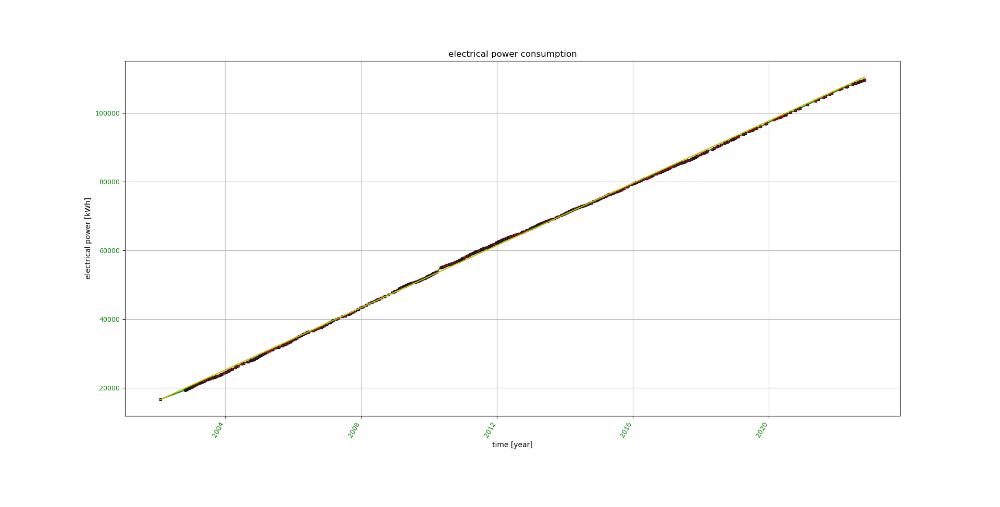

# consumption_analysis  

Python statistic software for consumption analysis of electrical power, fresh water, and oil

# Installation for (K)ubuntu LINUX:

1.  Put all python source code files of this github reposotory into a working directory
2.  Make consal.py executable: 'chmod +x consal.py'

`<working_dir>/..`

1.  consal.py
1.  graphics.py
1.  io_module.py
1.  messaging.py

Optional: Put example data bases into the working directory

`<working_dir>/..`

*   electrical_power_consumption.caf
*   oil_consumption.caf
*   water_consumption.caf

**Required python version** 2.7 (3.x does not work!)
             
**Required python modules:**

optparse, sys, os, numpy, scipy, time, datetime, pylab, matplotlib, re, string, exceptions

** Tested operating systems: **

Kubuntu 14.04, Kubuntu 16.04, Kubuntu 18.04

# Supported statistical analyses:

*  average consumption per day (in command line)  
*  time chart of consumption with linear regression (matplotlib chart)

*  time chart of average consumption between sampling points  (matplotlib chart)

*  time chart of 365 days moving average of consumption  (matplotlib chart)

*  time chart of delta of 1 year moving average of consumption  (matplotlib chart)

# Usage:

Usage: consal.py [options]

consal.py is doing a statistical analysis of electrical power,  water, and oil
consumptions

Options:

    --version         show program's version number and exit
  
    -h, --help        show this help message and exit
  
    --nc              no consistency check
  
    -n                create a new data base
  
    -i                input measurement(s)
  
    --wdir=DIRECTORY  working directory
  
    -v                show version
  
    -e                analyze electrical power consumption
  
    --ef=FILE         file storing data base for electrical power consumption
                      analysis
                    
    -o                analyze oil consumption
  
    --of=FILE         file storing data base for oil consumption analysis
  
    -w                analyze water consumption
  
    --wf=FILE         file storing data base for water consumption analysis

# Examples on usage:

**Please store the provided example data bases \*.caf in your working directory**

**Before creating a new data base, please reneame the provided example data bases \*.caf in your working directory**

1. Run analysis on provided data base for electrical power consumption:

	consal -e

2. Run analysis on provided data base for water consumption:

	consal -w

3. Run analysis on provided data base for heating oil consumption:

	consal -o

4. Add a new consumption value to an existing data base and then run an analysis of electrical power consumption:

	consal -i -e

5. Add a new consumption value to an existing data base and then run an analysis of water consumption:

	consal -i -w

6. Add a new consumption value to an existing data base and then run an analysis of heating oil consumption:

	consal -i -o

7. Create a new data base for electrical power consumption:

	consal -i -n -e

8. Create a new data base for water consumption:

	consal -i -n -w

9. Create a new data base for heating oil consumption:

	consal -i -n -o

# Enjoy and have fun!

                                                                                                                               
                                                                                                                               
                                                                                                                               
                                                                                                                               
                                                                                                                               
                                                                                                                               
                                                                 
