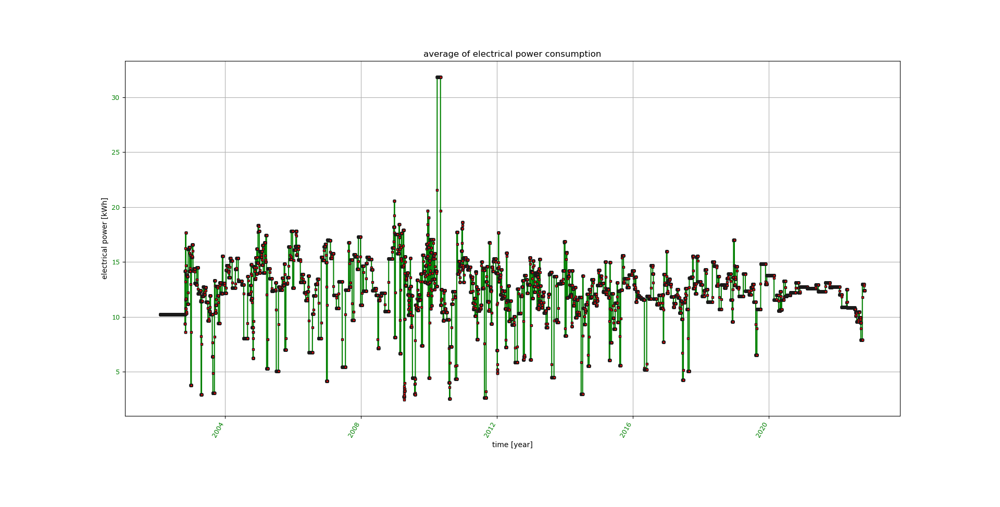
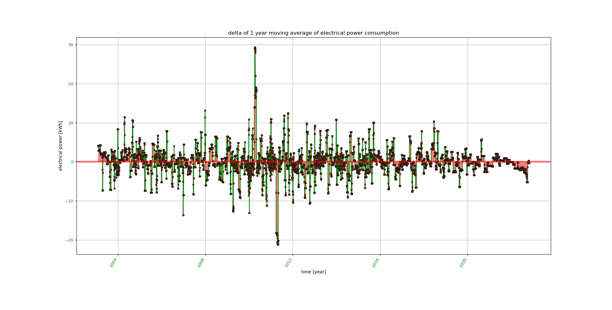

# consumption_analysis   

Python statistic software for consumption analysis of electrical power, fresh water, oil, gas, pellets, and heat pump energy

# Installation for [(K)ubuntu] LINUX:

1.  Put all python source code files of this github repository into a working directory
2.  Make consal.py executable: 'chmod +x consal.py'

`<working_dir>/..`

1.  consal.py
1.  graphics.py
1.  io_module.py
1.  messaging.py

Optional: Put example data bases into the working directory

`<working_dir>/..`

*   electrical_power_consumption.caf
*   oil_consumption.caf
*   water_consumption.caf
*   gas_energy_consumption.caf
*   pellets_energy_consumption.caf
*   heat_pump_energy_consumption.caf

**Required python version**
- 3.x
             
**Required python modules:**

- optparse, sys, os, numpy, scipy, time, datetime, pylab, matplotlib, re, string, builtins

**Tested operating systems:**

- Kubuntu 14.04, Kubuntu 16.04, Kubuntu 18.04, Kubuntu 22.04

**Other operating systems:**

- For other Linux OS, the code is working most probably as well
- For Windows OS, minor adaptions of the code might be necessary. Please do this on your own since I do not run any Microsoft OS.

# Supported statistical analyses:

*  average consumption per day (in command line)
*  please close the pop-up matplotlib charts for proceeding to the next chart (click to 'x' in upper right corner)
*  time chart of consumption with linear regression (matplotlib chart)

*  time chart of average consumption between sampling points  (matplotlib chart)

*  time chart of 365 days moving average of consumption  (matplotlib chart)

*  time chart of delta of 1 year moving average of consumption  (matplotlib chart)

# Important note for moving averages

* moving averages over one year will be calculated after at least one year of data collection
* therefore **for the first year** of data entries, no moving averages will be calculated nor displayed

# Usage:

Usage: python3 ./consal.py [options]

consal.py is doing a statistical analysis of electrical power,  water,  oil,
gas, pellets, and heat pump energy consumptions

Options:

    --version         show program's version number and exit
  
    -h, --help        show this help message and exit
  
    --nc              no consistency check
  
    -n                create a new data base (always use together with '-i')
  
    -i                input measurement(s)
  
    --wdir=DIRECTORY  working directory
  
    -v                show version
  
    -e                analyze electrical power consumption
  
    --ef=FILE         file storing data base for electrical power consumption
                      analysis
                    
    -o                analyze oil consumption
  
    --of=FILE         file storing data base for oil consumption analysis
  
    -w                analyze water consumption
  
    --wf=FILE         file storing data base for water consumption analysis
    
     -g                analyze gas consumption
     
     --wg=FILE         file storing data base for gas consumption analysis
     
     -p                analyze pellets consumption
     
     --wp=FILE         file storing data base for pellets consumption analysis
     
     -p                analyze pellets consumption
     
     --wp=FILE         file storing data base for pellets consumption analysis
     
     --hp              analyze heat pump consumption
     
     --whp=FILE        file storing data base for heat pump consumption analysis

# Examples on usage:

**Please store the provided example data bases \*.caf in your working directory**

**Before creating a new data base, please reneame the provided example data bases \*.caf in your working directory**

1. Run analysis on provided data base for electrical power consumption:

	consal -e

2. Run analysis on provided data base for water consumption:

	consal -w

3. Run analysis on provided data base for heating oil consumption:

	consal -o
	
4. Run analysis on provided data base for gas consumption:

	consal -g
	
5. Run analysis on provided data base for pellets consumption:

	consal -p

6. Run analysis on provided data base for heat pump energy consumption:

	consal --hp

7. Add a new consumption value to an existing data base and then run an analysis of electrical power consumption:

	consal -i -e

8. Add a new consumption value to an existing data base and then run an analysis of water consumption:

	consal -i -w

9. Add a new consumption value to an existing data base and then run an analysis of heating oil consumption:

	consal -i -o
	
10. Add a new consumption value to an existing data base and then run an analysis of gas consumption:

	consal -i -g

11. Add a new consumption value to an existing data base and then run an analysis of pellets consumption:

	consal -i -p
	
12. Add a new consumption value to an existing data base and then run an analysis of heat pump energy consumption:

	consal -i \--hp

13. Create a new data base for electrical power consumption:

	consal -i -n -e

14. Create a new data base for water consumption:

	consal -i -n -w

15. Create a new data base for heating oil consumption:

	consal -i -n -o
	
16. Create a new data base for gas consumption:

	consal -i -n -g
	
17. Create a new data base for pellets consumption:

	consal -i -n -p
	
18. Create a new data base for heat pump energy consumption:

	consal -i -n \--hp

# Enjoy and have fun saving energy!

# Update history:

-   13th June 2021: Migration to python3  
-   28th October 2022: Fixes due to library updates, update of images
-   21st November 2022: Added analysis options for gas, pellets, and heat pump energy

                                                                                                                               
                                                                                                                               
                                                                                                                               
                                                                                                                               
                                                                                                                               
                                                                                                                               
                                                                 
