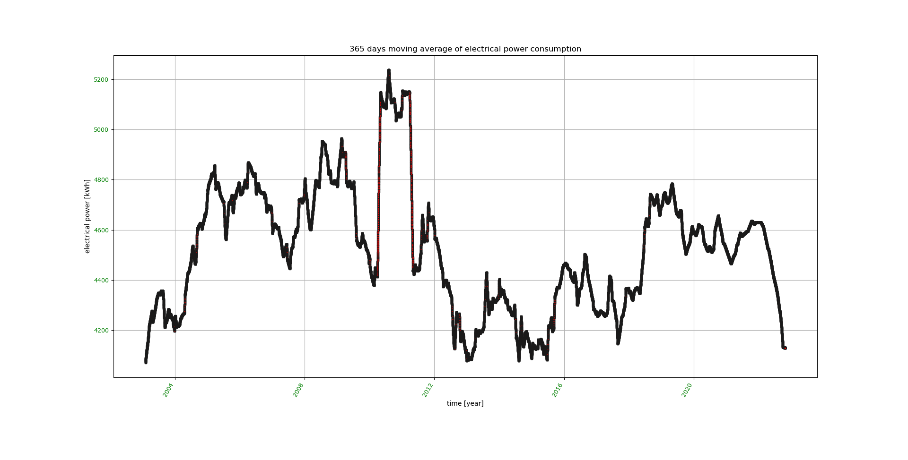

# consumption_analysis   

Python statistic software for consumption analysis of electrical power, fresh water, oil, gas, pellets, heat pump energy, and firewood

# Installation for [(K)ubuntu] LINUX / Raspian OS:

1.  Put all python source code files of this github repository into a working directory, e.g. download and unpack the latest release  [consumption_analysis.tgz ](https://github.com/FUEL4EP/consumption_analysis/releases/latest)
2.  Make consal.py executable: 'chmod +x consal.py'

`<working_dir>/..`

1.  consal.py
1.  graphics.py
1.  io_module.py
1.  messaging.py

Optional: Put example data bases into the working directory

`<working_dir>/..`

*   electrical_power_consumption.caf
*   oil_consumption.caf
*   water_consumption.caf
*   gas_energy_consumption.caf
*   pellets_energy_consumption.caf
*   heat_pump_energy_consumption.caf
*   firewood_mass_consumption.caf

**Required python version**
- 3.x
- python2 is **NOT** supported anymore
             
**Required python modules:**

- optparse, sys, os, numpy, scipy, time, datetime, pylab, matplotlib, re, string, builtins

**Tested operating systems:**

- Kubuntu 14.04, Kubuntu 16.04, Kubuntu 18.04, Kubuntu 22.04  
- Raspian GNU/LINUX 11 (bullseye)

**Other operating systems:**

- For other Linux OS, the code is working most probably as well
- For Windows OS, minor adaptions of the code might be necessary. Please do this on your own since I do not run any Microsoft OS.

# Supported statistical analyses:

*  average consumption per day (in command line)
*  please close the pop-up matplotlib charts for proceeding to the next chart (click to 'x' in upper right corner)
*  time chart of consumption with linear regression (matplotlib chart)

*  time chart of average consumption between sampling points  (matplotlib chart)

*  time chart of 365 days moving average of consumption  (matplotlib chart)

*  time chart of delta of 1 year moving average of consumption  (matplotlib chart) thus compensating seasonal effects. Such, the savings or the increases of a consumption are more easily visible.

# Important note for moving averages

* moving averages over one year will be calculated after at least one year of data collection
* therefore **for the first year** of data entries, no moving averages will be calculated nor displayed

# Hints for consumption inputs

- The readings of a consumption meter should be inputted into the 'consal' software immediately after reading. The concerning time stamp of the data base is taken based on the system time of your computer at the time of the input.
- The readings can be done at any time. They can be non-equidistant in time.
- The time span between two readings can vary arbitrarily, e.g. after 1 hour, then after 3.2 days, then after 1.34 weeks, then after 5.6 hours, ..
- For creating the graphical views, the data base vectors <time of reading, readout value> are resampled equidistantly in time, in the current software version  every 3 hours.
- In case of a newly created data base, the next data base input should be done after the resampling time at the earliest, i.e. after 3 hours.

# Usage:

Usage: python3 ./consal.py [options]

consal.py is doing a statistical analysis of electrical power,  water,  oil,
gas, pellets, and heat pump energy consumptions

Options:

    --version         show program's version number and exit
  
    -h, --help        show this help message and exit
  
    --nc              no consistency check
  
    -n                create a new data base (always use together with '-i')
  
    -i                input measurement(s)
  
    --wdir=DIRECTORY  working directory
  
    -v                show version
  
    -e                analyze electrical power consumption
  
    --ef=FILE         file storing data base for electrical power consumption
                      analysis
                    
    -o                analyze oil consumption
  
    --of=FILE         file storing data base for oil consumption analysis
  
    -w                analyze water consumption
  
    --wf=FILE         file storing data base for water consumption analysis
    
     -g                analyze gas consumption
     
     --wg=FILE         file storing data base for gas consumption analysis
     
     -p                analyze pellets consumption
     
     --wp=FILE         file storing data base for pellets consumption analysis
     
     -p                analyze pellets consumption
     
     --wp=FILE         file storing data base for pellets consumption analysis
     
     --hp              analyze heat pump consumption
     
     --whp=FILE        file storing data base for heat pump consumption analysis
     -f                analyze firewood mass consumption of a stove (note: mass
                       of each oven charge needs to be inputted)
                       
    --ff=FILE          file storing data base for firewood mass consumption
                       analysis                     
                       

# Input modes

1. Input of meter readings
    - For water, electricity, gas, oil, heat pump energy, pellets energy
    - The inputted consumption values are already summed-up by the meter 
2. Input of non-meter readings, e.g. firewood charge of a stove
    - For firewood charge of a stove
    - The inputted consumption values are not summed-up by a meter, but **each** furnance charge is weigthed by a scale. The summing-up is done by the 'consal' software instead.
    - **IMPORTANT**: For summing-up the firewood mass consumption correctly, **each furnance charge needs to be weigthed and the firewood weight needs to be inputted with 'consal -f -i', see also below.**

# Examples on usage:

**Please store the provided example data bases \*.caf in your working directory**

**Before creating a new data base, please reneame the provided example data bases \*.caf in your working directory**

1. Run analysis on provided data base for electrical power consumption:

	consal -e

2. Run analysis on provided data base for water consumption:

	consal -w

3. Run analysis on provided data base for heating oil consumption:

	consal -o
	
4. Run analysis on provided data base for gas consumption:

	consal -g
	
5. Run analysis on provided data base for pellets consumption:

	consal -p

6. Run analysis on provided data base for heat pump energy consumption:

	consal --hp
	
7. Run analysis on provided data base for firewood mass consumption:

	consal -f

8. Add a new consumption value to an existing data base and then run an analysis of electrical power consumption:

	consal -i -e

9. Add a new consumption value to an existing data base and then run an analysis of water consumption:

	consal -i -w

10. Add a new consumption value to an existing data base and then run an analysis of heating oil consumption:

	consal -i -o
	
11. Add a new consumption value to an existing data base and then run an analysis of gas consumption:

	consal -i -g

12. Add a new consumption value to an existing data base and then run an analysis of pellets consumption:

	consal -i -p
	
13. Add a new consumption value to an existing data base and then run an analysis of heat pump energy consumption:

	consal -i \--hp
	
14. Add the weight of a new furnance charge to an existing data base and then run an analysis of firewood mass consumption:

	consal -i -f

15. Create a new data base for electrical power consumption:

	consal -i -n -e

16. Create a new data base for water consumption:

	consal -i -n -w

17. Create a new data base for heating oil consumption:

	consal -i -n -o
	
18. Create a new data base for gas consumption:

	consal -i -n -g
	
19. Create a new data base for pellets consumption:

	consal -i -n -p
	
20. Create a new data base for heat pump energy consumption:

	consal -i -n \--hp
	
21. Create a new data base for firewood mass consumption:

	consal -i -n -f

# Enjoy and have fun saving energy!

# Update history:

-   13th June 2021: Migration to python3  
-   28th October 2022: Fixes due to library updates, update of images
-   21st November 2022: Added analysis options for gas, pellets, and heat pump energy
-   15th December 2022: Added analysis option for firewood mass consumption  
                        Decreased resampling time to 3 hours

                                                                                                                               
                                                                                                                               
                                                                                                                               
                                                                                                                               
                                                                                                                               
                                                                                                                               
                                                                 
